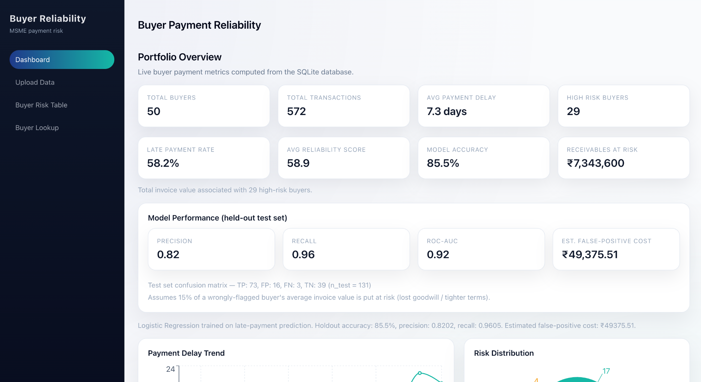
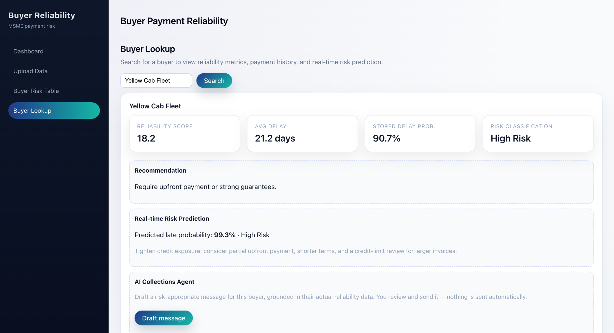
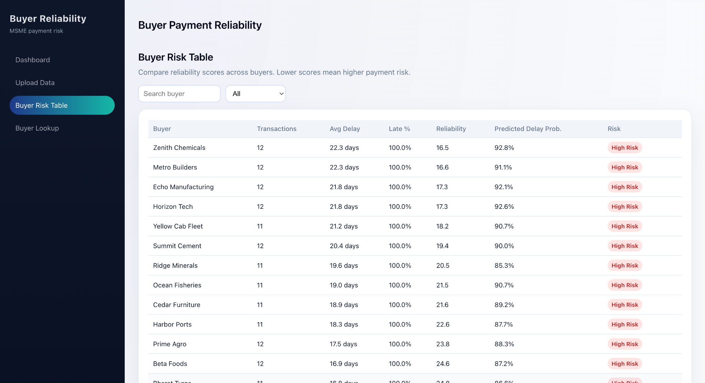

#CrediShield AI

### AI-Powered Buyer Risk & Reliability System for MSMEs

CrediShield AI helps MSMEs identify unreliable B2B buyers before delayed invoice payments turn into significant cash-flow risk.

The system combines buyer payment history, behavioural analytics, machine learning risk prediction, and an AI Collections Agent to help accounts-receivable teams make faster, data-driven decisions.

## What it does

1. Upload invoice CSV data or seed sample transaction data
2. Analyse historical buyer payment behaviour
3. Calculate buyer reliability scores and risk classifications
4. Predict the probability of late payment using machine learning
5. Provide buyer-specific payment and credit recommendations
6. Generate risk-appropriate collections messages using Gemini
7. Allow a human accounts-receivable team member to review the generated message before sending

## Key Metrics

The system evaluates its ML model on a held-out test set.

| Metric | Result |
|--------|--------:|
| Accuracy | 85.5% |
| Precision | 82% |
| Recall | 96% |
| ROC-AUC | 0.92 |

The system also estimates the potential cost of false-positive risk flags to make model performance more meaningful for financial decision-making.

## AI Collections Agent

The AI Collections Agent uses buyer information and risk signals already computed by the system to generate a short, risk-appropriate collections message.

The LLM is responsible for drafting the communication, not determining the underlying risk score.

The workflow is:

```text
Buyer Payment Data
        ↓
Risk & Reliability Analysis
        ↓
Late-Payment Prediction
        ↓
Risk Classification
        ↓
Payment / Credit Recommendation
        ↓
AI Collections Agent
        ↓
Buyer-Specific Message
        ↓
Human Review
````

The agent does not automatically contact buyers or send messages.

If the Gemini API is unavailable, the application falls back to a deterministic rule-based message template so the feature continues to work without an external LLM dependency.

## Dashboard



## Buyer Lookup & AI Collections



## Risk Table



## Tech Stack

* React
* Vite
* Recharts
* FastAPI
* SQLAlchemy
* SQLite
* Pandas
* scikit-learn
* Logistic Regression
* Joblib
* JWT Authentication
* Gemini API

## Architecture

```text
                    ┌─────────────────────┐
                    │  Invoice / Buyer    │
                    │       Data          │
                    └──────────┬──────────┘
                               ↓
                    ┌─────────────────────┐
                    │ Data Processing &   │
                    │ Feature Engineering │
                    └──────────┬──────────┘
                               ↓
                    ┌─────────────────────┐
                    │ Buyer Behaviour &   │
                    │ Reliability Metrics │
                    └──────────┬──────────┘
                               ↓
                    ┌─────────────────────┐
                    │ ML Risk Prediction  │
                    │ Logistic Regression │
                    └──────────┬──────────┘
                               ↓
                    ┌─────────────────────┐
                    │ Risk Classification │
                    │ & Recommendation    │
                    └──────────┬──────────┘
                               ↓
                    ┌─────────────────────┐
                    │ AI Collections      │
                    │ Agent (Gemini)      │
                    └──────────┬──────────┘
                               ↓
                    ┌─────────────────────┐
                    │ Human Review &      │
                    │ Final Communication │
                    └─────────────────────┘
```

## Project Structure

```text
backend/
    main.py          API routes
    schemas.py       Request/response models
    ingest.py        CSV → analytics → ML → database pipeline
    analytics.py     Reliability scores and payment behaviour analysis
    ml_model.py      Logistic Regression training and prediction
    agent.py         Gemini-powered AI Collections Agent
    auth.py          JWT authentication
    database.py      Database configuration
    models.py        SQLAlchemy database models
    seed.py          Sample data loader

frontend/
    src/
        pages/
            DashboardPage.jsx
            UploadPage.jsx
            RiskTablePage.jsx
            BuyerLookupPage.jsx
            LoginPage.jsx
        api.js
        App.jsx

datasets/
    sample_transactions.csv
```

## Main APIs

| Method | Path                          | Purpose                                         |
| ------ | ----------------------------- | ----------------------------------------------- |
| POST   | `/login`                      | Authenticate user and obtain JWT                |
| POST   | `/upload`                     | Replace data and retrain the model              |
| GET    | `/dashboard`                  | Dashboard KPIs and chart data                   |
| GET    | `/buyers`                     | Buyer risk table                                |
| GET    | `/buyer/{name}`               | Buyer profile and reliability data              |
| GET    | `/buyer/{name}/history`       | Buyer invoice/payment history                   |
| POST   | `/predict`                    | Real-time late-payment risk prediction          |
| POST   | `/buyer/{name}/agent-message` | Generate a risk-appropriate collections message |
| GET    | `/model/info`                 | Model performance and evaluation metrics        |
| GET    | `/stats`                      | Portfolio statistics                            |
| GET    | `/health`                     | Application health check                        |

## How the ML Works

### Target

The prediction target is whether an invoice was paid late:

```text
payment_date > due_date
```

### Features

The model uses transaction and buyer-history features including:

* Invoice amount
* Payment terms
* Month
* Buyer payment history available before the invoice
* Historical payment behaviour

Buyer-history features are calculated using information available before the target invoice to reduce data leakage.

### Model

The prediction pipeline uses:

```text
StandardScaler
      ↓
LogisticRegression
```

The model outputs the probability that an invoice will be paid late.

### Evaluation

Model performance is evaluated using a held-out test set.

The application exposes the evaluation results through `/model/info` and displays the relevant metrics in the interface.

## Buyer Reliability Scoring

In addition to the ML prediction, the application calculates a buyer-level reliability score using historical payment behaviour.

The score considers factors such as:

* Average payment delay
* Percentage of invoices paid late
* Historical transaction behaviour
* Early/on-time payment evidence
* Recent payment trends

Buyers are classified into:

* **Low Risk**
* **Medium Risk**
* **High Risk**

The resulting risk classification is used to provide an appropriate payment or credit recommendation.

## Authentication

The backend uses JWT-based authentication for protected APIs.

For the included demo environment:

```text
Email: test@example.com
Password: 1234
```

## Sample Dataset

The included sample dataset contains:

* 572 transactions
* 50 buyers

The sample data can be loaded using the seed command.

## Quick Start

### Backend

Install the Python dependencies:

```bash
python3 -m pip install -r requirements.txt
```

Load the sample dataset:

```bash
python3 -m backend.seed
```

Start the FastAPI backend:

```bash
python3 -m uvicorn backend.main:app --reload --port 8000
```

### Frontend

Open another terminal:

```bash
cd frontend
npm install
npm run dev
```

Then open:

```text
http://localhost:5173
```

## Gemini Setup

The AI Collections Agent can use the Gemini API to generate buyer-specific messages.

Create a `.env` file from `.env.example` and add your Gemini API key:

```env
GEMINI_API_KEY=your_api_key_here
GEMINI_MODEL=gemini-3.5-flash-lite
```

Do not commit `.env` or API keys to the repository.

If no Gemini API key is configured, the application automatically uses its rule-based fallback message generator.

